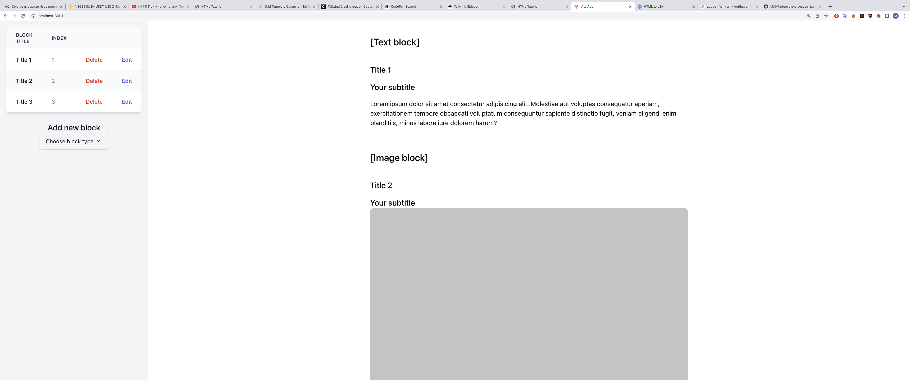

# Valuecase Tech Challenge

We have prepared a little skeleton for you to get productive immediately 🚀

Stack:
- PostgreSQL database
- Nest.js Backend
- React + Vite Frontend

## Requirements
- node
- yarn
- docker
- your coding skills

## Fetch dependencies

```
cd frontend
yarn
cd ../backend
yarn
```

## Database

First launch the database 
```
chmod +x ./db/start-dev-db.sh 
./db/start-dev-db.sh
```

## Launch backend

Next launch the backend. It will create the database schema automatically.

Nest.js provides two launch modes:

Simple run:
```
cd backend
yarn start
```

Dev mode – watches for changes:
```
cd backend
yarn start:dev
```

The backend will be available under `localhost:3000`.

## Launch frontend

```
cd frontend
yarn dev
```

The frontend will be available under `localhost:3001`.

The Vite dev server is configured in a way, that calls to `/api` will be redirected to the backend:
- `POST localhost:3001/api/images/upload` will be redirected as `POST localhost:3000/images/upload`
- `GET localhost:3001/api` will be redirected as `GET localhost:3000`

## Uploading files

I already developed a veeery simple file storage API.
- `POST /api/images/upload`
  - upload an image
- `GET /api/images/{imageId}`
  - this endpoint serves the file with the correct content type header

`App.tsx` also shows how to upload files with that API :)

## Tips

- Install the Nest.js CLI, it provides commands to bootstrap new backend components :)
  - [https://docs.nestjs.com/cli/overview](https://docs.nestjs.com/cli/overview)
- Use any styling method you'd like to use for the frontend part. You can use
  - css files and
  - styled-components out of the box.
- axios is already installed.
